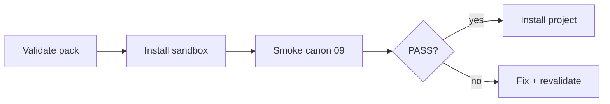

# Documentation index — pack v1.1.0

| Ruta | Audiencia | Contenido |
|------|-----------|-----------|
| [`../start/README.md`](../start/README.md) | Todos | Bootstrap |
| [`human/TEAM-ONBOARDING.md`](human/TEAM-ONBOARDING.md) | Humanos | Primer día |
| [`human/install/`](human/install/) | Humanos | Cursor, Antigravity, OpenCode, Codex |
| [`agent/AGENT-HANDOFF.md`](agent/AGENT-HANDOFF.md) | Agentes | Continuidad sesión |
| [`agent/MODEL-ROUTING-POLICY.md`](agent/MODEL-ROUTING-POLICY.md) | Agentes | Política modelos |
| [`agent/CONTEXT-MAP.md`](agent/CONTEXT-MAP.md) | Agentes | Token budget |
| [`maintainer/DISTRIBUTION-CHECKLIST.md`](maintainer/DISTRIBUTION-CHECKLIST.md) | Maintainer | Release |

## Tooling

| Ruta | Función |
|------|---------|
| [`../tooling/scripts/`](../tooling/scripts/) | Install + validate |
| [`../tooling/bench/`](../tooling/bench/) | Benchmark opcional |
| [`../tooling/sandbox/pilot/`](../tooling/sandbox/pilot/) | Piloto default |

## Flujo

Stubs en root y `docs/` plano redirigen aquí o a `canon/` / `runtime/`.
